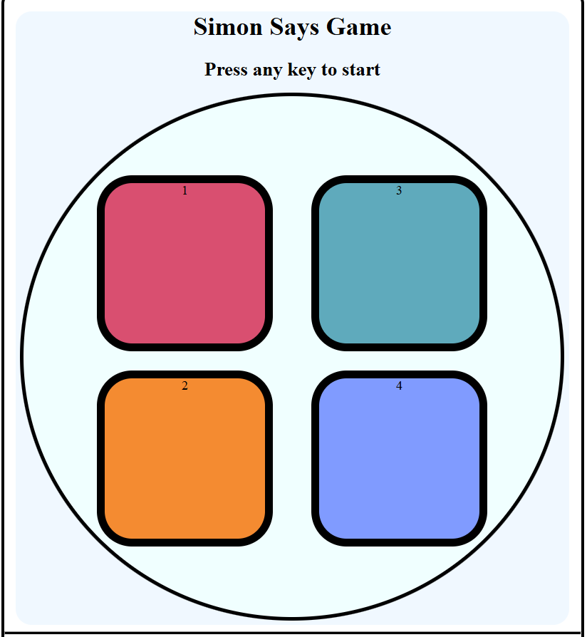

# 🎮 Simon Says Game  
**Activity — Developed by Aslam Siddiki**

A fun, memory-based **Simon Says Game** built using **HTML, CSS, and JavaScript**.  
Test your memory and focus by repeating the flashing color sequence correctly to reach higher levels!

---

## 🌟 Features
- 🎨 Interactive color buttons (`pink`, `orange`, `blue`, `indigo`)
- 🚀 Level-based gameplay — each level adds a new color to the sequence
- 💾 Keeps track of your **highest score**
- 💡 Visual feedback for correct and wrong inputs
- ⚡ Smooth flash animations and transitions

---

## 🕹️ How to Play

1. **Start the Game** → Press any key on your keyboard.  
2. **Watch Carefully** → One or more buttons will flash — that’s the sequence to remember.  
3. **Repeat the Sequence** → Click the buttons in the **same order** as shown.  
4. **Level Up** → Each round adds one new color to the pattern.  
5. **Game Over** → If you click the wrong button, the game ends and shows your score.  
   Press any key again to restart.

---

## 🧠 Example Gameplay
| Level | Game Sequence | Your Input | Result |
|:------:|:---------------|:-------------|:---------|
| 1 | 🩷 Pink | 🩷 Pink | ✅ Correct |
| 2 | 🩷 Pink → 🟧 Orange | 🩷 Pink → 🟧 Orange | ✅ Correct |
| 3 | 🩷 Pink → 🟧 Orange → 💙 Blue | 🩷 Pink → 💙 Blue | ❌ Game Over |

---

## 🧩 Technologies Used
- **HTML** – Structure  
- **CSS** – Styling and animations  
- **JavaScript (Vanilla JS)** – Game logic and event handling  

---

## 📸 Demo Screenshot
Example:  

---

👨‍💻 Developer  
Aslam Siddiki  
🎯 Activity Project — Simon Says Game

